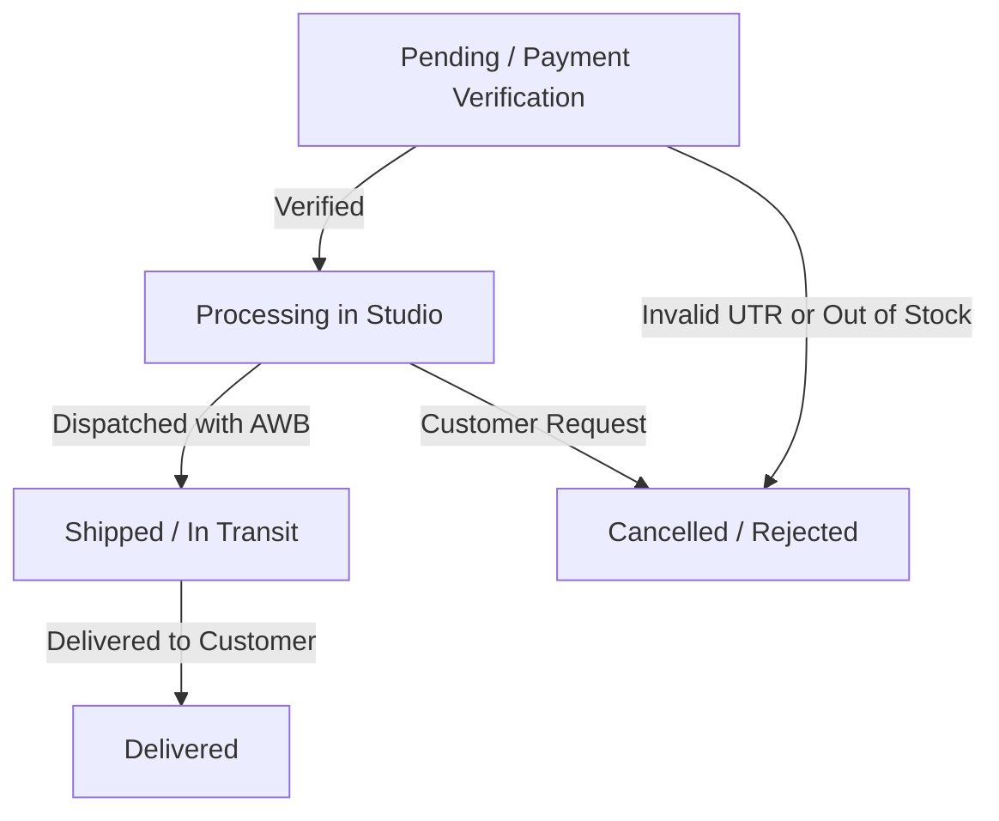

# Store Management & Admin Portal User Guide

This guide explains how to manage day-to-day store operations, fulfill orders, manage catalog inventory, configure promotions, and update storefront content using the built-in Admin Portal.

---

## Table of Contents
1. [Logging In & Security](#1-logging-in--security)
2. [Dashboard Analytics](#2-dashboard-analytics)
3. [Order Fulfillment Workflow](#3-order-fulfillment-workflow)
4. [Product & Inventory Management](#4-product--inventory-management)
5. [Categories & Megamenu](#5-categories--megamenu)
6. [Coupons & Promotions](#6-coupons--promotions)
7. [Customer Directory & Moderation](#7-customer-directory--moderation)
8. [Customer Reviews Moderation](#8-customer-reviews-moderation)
9. [Storefront CMS & Settings Hub](#9-storefront-cms--settings-hub)

---

## 1. Logging In & Security

### Accessing the Portal
Navigate to `/admin/login` on your domain (e.g. `https://yourstore.com/admin/login`).

### Authentication Methods
You can authenticate using either of two methods:
1. **Master Passcode**: Enter the `ADMIN_SECRET_KEY` configured in your `.env` file. This grants instant administrator access.
2. **Email & Password**: Enter your registered admin credentials (default: `admin@mecommerce.dev` / `mecommerce_admin_2026`).

### Disabling Demo Admin in Production
For security, ensure the demo account button is turned off on live stores:
- In `.env`: Set `ENABLE_DEMO_ADMIN="false"` and `NEXT_PUBLIC_ENABLE_DEMO_ADMIN="false"`.

---

## 2. Dashboard Analytics

The dashboard home provides an overview of store performance:

- **Total Revenue**: Cumulative revenue from paid orders.
- **Total Orders**: All placed orders across all statuses.
- **Average Order Value (AOV)**: Revenue divided by completed orders.
- **Customer Count**: Total registered user accounts.
- **Recent Orders Table**: The latest customer transactions with status badges and quick view links.

---

## 3. Order Fulfillment Workflow

Navigate to **Admin** ➔ **Orders** (`/admin/dashboard/orders`).

### Order Status Lifecycle

### 1. Verifying Manual UPI QR Payments
When a customer pays via UPI QR, the order enters `Pending` status.
1. Click on the order to view the **Order Dossier**.
2. Locate the customer's submitted **12-digit UTR / Transaction Reference Number**.
3. Open your business banking app (Google Pay for Business, PhonePe, Paytm, or netbanking) and confirm receipt of that exact UTR and amount.
4. Once verified, change the status to **Processing**.

### 2. Processing and Shipping Orders
1. Pack the customer's items (refer to line items and any custom gift notes in the dossier).
2. Generate your courier shipping label (BlueDart, Delhivery, DTDC, India Post, etc.).
3. In the Order Dossier:
   - Change status to **Shipped**.
   - Enter the **Courier Name** (e.g. `Delhivery`).
   - Enter the **Tracking Number (AWB)** (e.g. `DEL123456789`).
   - (Optional) Enter the direct tracking URL.
4. Click **Update Order**. The customer's order tracking page immediately updates with their live AWB number.

### 3. Rejecting or Cancelling Orders
If an order must be rejected (e.g. invalid payment proof, out of stock):
1. Change status to **Cancelled**.
2. Enter a **Rejection / Cancellation Reason** in the note field.
3. Save the order. The customer can see this explanation in their account order tracking timeline.

### 4. Printing Invoices & Packing Slips
Click the **Print Packing Slip** button inside any order dossier to generate a clean, printer-friendly summary with customer delivery address, items, quantities, and gift notes.

---

## 4. Product & Inventory Management

Navigate to **Admin** ➔ **Products** (`/admin/dashboard/products`).

### Adding a New Product
Click **+ Add Product** and fill in the details:
- **Title**: Product name (e.g. `Handmade Resin Bookmark`).
- **Slug**: URL identifier (e.g. `handmade-resin-bookmark`). Generated automatically from the title.
- **Price**: Selling price in your currency (e.g. `499`).
- **Compare-at Price**: Original/strike-through price to show a discount (e.g. `699`).
- **Inventory Stock**: Current units on hand. When stock reaches 0, the store displays an *Out of Stock* badge.
- **Category**: Select the primary category and optional subcategory.
- **Product Images**: Upload or paste image URLs. The first image becomes the main cover photo. Additional images appear in the product gallery.
- **Description**: Detailed product write-up, materials, and care instructions.

### Bespoke Customization Options
Under the **Customization Options** section, toggle features customers can select on the product page:
- **Enable Gift Wrapping**: Offers optional gift box packaging at checkout.
- **Enable Hand-Poured Wax Seal**: Offers custom wax seal stamp packaging.
- **Enable Handwritten Gift Note**: Provides a text box for the customer's personal message.
- **Studio Craft Lead Time**: Specify production days (e.g. `Made to order: 2-3 business days`).

---

## 5. Categories & Megamenu

Navigate to **Admin** ➔ **Categories** (`/admin/dashboard/categories`).

### Managing Categories
- **Add Category**: Enter category name, URL slug, and optional description.
- **Subcategories**: Group items cleanly (e.g., Category: *Accessories* ➔ Subcategory: *Bookmarks*, *Keychains*).
- **Megamenu Thumbnail**: Upload a high-resolution cover photo for the category. This image appears on the navigation bar hover card when customers browse on desktop.

---

## 6. Coupons & Promotions

Navigate to **Admin** ➔ **Coupons** (`/admin/dashboard/coupons`).

### Creating a Coupon Code
Click **+ Create Coupon**:
- **Coupon Code**: The text customers enter at checkout (e.g. `WELCOME10`, `FESTIVE500`). Uppercase letters and numbers recommended.
- **Discount Type**:
  - **Percentage**: Deducts a percentage (e.g. `10%` off).
  - **Fixed Amount**: Deducts a flat currency amount (e.g. `₹100` off).
- **Minimum Spend**: Minimum cart subtotal required to apply the code (e.g. `₹999`).
- **Usage Limit**: Maximum times this coupon can be redeemed across all customers (leave empty for unlimited).
- **Expiration Date**: Date after which the code automatically becomes invalid.

### Viewing Redemptions
Click on any coupon in the list to see an audit log of which customer redeemed the coupon, their order ID, and the discount amount applied.

---

## 7. Customer Directory & Moderation

Navigate to **Admin** ➔ **Customers** (`/admin/dashboard/customers`).

- **Customer List**: View customer names, email addresses, phone numbers, and registration dates.
- **Lifetime Spend**: View the total money spent and total orders completed per customer.
- **Account Status**:
  - **Active**: Normal customer permissions.
  - **Suspended / Banned**: Immediately blocks the customer from logging in, checking out, or placing orders.

---

## 8. Customer Reviews Moderation

Navigate to **Admin** ➔ **Reviews** (`/admin/dashboard/reviews`).

- **Review Feed**: View incoming customer star ratings, comments, and reviewer names.
- **Approve / Hide**: Toggle visibility of reviews on public product pages.
- **Official Store Replies**: Post a public response beneath a customer review. Replies display an official *Verified Store Owner* badge.

---

## 9. Storefront CMS & Settings Hub

Navigate to **Admin** ➔ **Settings** (`/admin/dashboard/settings`).

The Settings Hub lets you change store branding, content, and policies without editing code:

### 1. Announcement Bar (`Settings ➔ Announcement`)
- **Ticker Message**: Promotional text displayed at the top of every page (e.g. `Free Shipping on orders above ₹999`).
- **Banner Link**: Optional destination URL when customers click the banner.
- **Background Color**: Custom hex color for the announcement bar.
- **Auto-Scroll Animation**: Toggle smooth marquee scrolling for longer announcements.

### 2. Hero Banner (`Settings ➔ Homepage`)
- **Headline**: Main title on the homepage hero section.
- **Subheadline**: Supporting sentence or brand philosophy.
- **Call-to-Action Buttons**: Button text and links (e.g. `Explore Catalog` ➔ `/catalog`).
- **Hero Image**: Background image URL for the homepage header.

### 3. Store Branding & Identity (`Settings ➔ Branding`)
- **Store Name**: Displayed in navigation, invoices, and browser tab titles.
- **Store Tagline**: Brand tagline shown in headers and search engine previews.
- **Social Media Links**: Instagram profile URL and WhatsApp support number.
- **Logo Sizing**: Adjust height and width for your brand logo.
- **Favicon & Monogram**: Select an automated 2-letter SVG monogram or paste custom SVG code for your browser tab icon.

### 4. Brand Story & About Page (`Settings ➔ Story`)
- Edit the content displayed at `/about`.
- Write your studio's founding mission, artisan background, and craft techniques using formatted text.

### 5. Payment Methods (`Settings ➔ Security & Payments`)
- **Razorpay**: Enable or disable card/netbanking payments.
- **UPI QR**: Configure your UPI ID (VPA) and Payee Name for dynamic QR payments.
- **Cash on Delivery (COD)**:
  - Enable or disable COD option.
  - Set a COD handling charge (e.g. `₹50`).
  - Set a maximum order limit for COD (e.g. `₹5,000`).

### 6. Shipping & Delivery (`Settings ➔ Shipping`)

- **Free Shipping Threshold**: Cart amount that unlocks free shipping (e.g. `₹999`).
- **Standard Shipping Fee**: Default delivery charge for orders below the threshold (e.g. `₹79`).
- **Estimated Delivery Window**: Text shown on product pages (e.g. `3 - 5 business days`).

### 7. Themes & Color Accents (`Settings ➔ Themes`)

- Switch between pre-configured aesthetic palettes (Warm Editorial, Minimalist Stone, Dark Luxury).
- Changes take effect across buttons, badges, links, and accents across the entire site.
